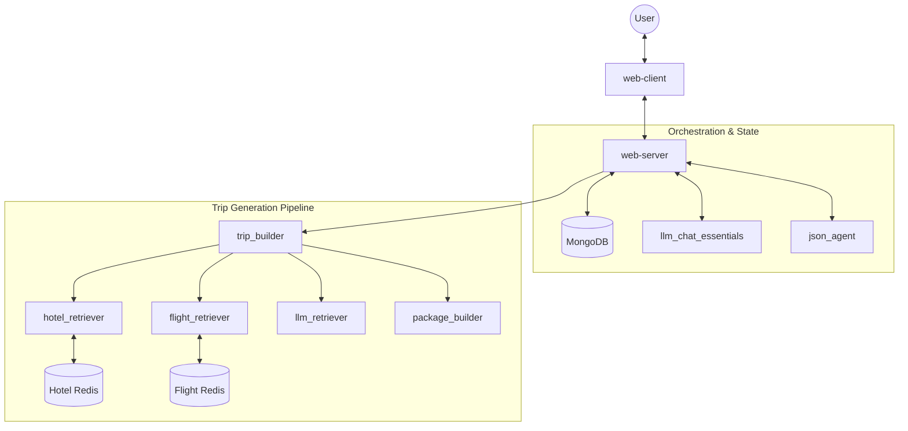

# Tripping AI - Backend Architecture 🏗️

This document describes the backend architecture of Tripping AI, detailing the microservices, their responsibilities, and how they interact to generate comprehensive travel itineraries.

## 🗺️ System Overview

The backend is designed as a distributed system of specialized services, orchestrated primarily by the `web_server`. This modular approach allows each component to focus on a specific domain (e.g., flight retrieval, LLM chat, JSON patching).

### Core Architecture Diagram

## 🛠️ Service Breakdown

### 1. Web Server (`apps/web-server`)
- **Role**: API Gateway & Orchestrator.
- **Tech**: Node.js, Express, TypeScript.
- **Responsibilities**:
    - Manages user sessions and chat history in MongoDB.
    - Orchestrates the "Requirement Gathering" phase with `llm_chat_essentials`.
    - Triggers the "Trip Search" pipeline via `trip_builder`.
    - Handles "Edit Mode" requests using `json_agent`.

### 2. Trip Builder (`apps/trip_builder`)
- **Role**: Workflow Coordinator for data collection.
- **Tech**: Python, FastAPI.
- **Responsibilities**:
    - Receives a high-level "Trip Request".
    - Parallelizes requests to various data retrievers (Hotels, Flights, etc.).
    - Sends collected raw data to `package_builder` for final formatting.

### 3. LLM Chat Essentials (`apps/llm_chat_essentials`)
- **Role**: Conversational Intelligence.
- **Tech**: Python, FastAPI, LLM (Perplexity/OpenAI).
- **Responsibilities**:
    - Analyzes chat messages to extract structured travel parameters.
    - Maintains the "Trip YAML" — a configuration object representing the user's needs.
    - Generates follow-up questions to fill missing information (e.g., "Where do you want to fly from?").

### 4. JSON Agent (`apps/json_agent`)
- **Role**: Structured Data manipulation.
- **Tech**: Python, FastAPI, LLM.
- **Responsibilities**:
    - Generates initial "Trip Plans" (high-level vibes) based on the Trip YAML.
    - Performs "JSON Patching" when a user asks for modifications (e.g., "Make the second option 5-star only").

### 5. Package Builder (`apps/package_builder`)
- **Role**: Final Itinerary Assembler.
- **Tech**: Python, FastAPI.
- **Responsibilities**:
    - Takes raw data from multiple sources and selects the "best fit" items.
    - Organizes data into a chronological, visual-ready `FinalTripLayout`.

### 6. Data Collectors
- **Flight Retriever (`apps/data_collectors/flight_retriever`)**: Fetches flight data from the Amadeus API with aggressive Redis caching.
- **Hotel Retriever (`apps/data_collectors/hotel_retriever`)**: Specialized in searching and filtering hotel options.
- **LLM Retriever (`apps/data_collectors/llm_retreiver`)**: Uses LLMs to discover local activities, restaurants, and transfer options that standard APIs might miss.

## 🔄 Data Flow: A Typical Trip Search

1. **Conversation**: User chats with `web-client`. `web-server` sends text to `llm_chat_essentials`.
2. **Commitment**: Once `llm_chat_essentials` signals the "Trip YAML" is complete, the `web-server` triggers `json_agent`.
3. **Planning**: `json_agent` generates 3 distinct "Vibes" (Plan objects).
4. **Building**: For each vibe, `web-server` calls `trip_builder`.
5. **Collection**: `trip_builder` concurrently asks `flight_retriever`, `hotel_retriever`, and `llm_retriever` for data.
6. **Packaging**: `trip_builder` sends all results to `package_builder`.
7. **Delivery**: The `web-server` polls/streams the `FinalTripLayout` back to the user.

## 🗄️ Shared Library (`shared/`)

A critical part of the monorepo is the `shared` directory, which contains:
- **TypeScript Types**: Shared between `web-client` and `web-server`.
- **Python Models (Pydantic)**: Shared across all Python microservices.
- **Protobuf/JSON Schemas**: Defining the contract between services to ensure data consistency.
